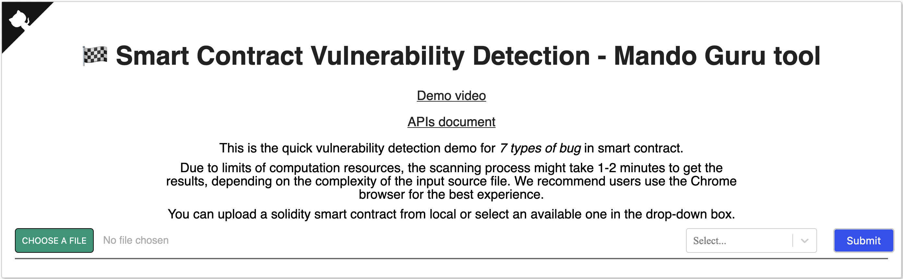

# MANDO-GURU services

### This project was created to bring out the APIs of vulnerability detection for smart contracts.

# Overview

#### The MANDO-GURU tool with three main components: Backend, RESTful APIs, and Frontend.
- Backend plays a vital role with several core sub-components such as heterogeneous presentation for the generated graphs from input smart contract files, heterogeneous graph fusion, custom multi-metapaths extraction, heterogeneous graph neural network, and vulnerability detections in coarse-grained and fine-grained levels.
- Frontend component services are used to visualize the pre-
diction results and the statistics of the analyzed smart contracts
- RESTful APIs are implemented as a bridge to communicate between the Backend and the Frontend
# Table of contents
- [MANDO-GURU services](#mando-guru-services)
- [Overview](#overview)
- [Table of contents](#table-of-contents)
- [Deploy MANDO-GURU services in a local machine](#deploy-mando-guru-services-in-a-local-machine)
    - [Backend](#backend)
    - [Frontend](#frontend)
- [How to use the tool?](#how-to-use-the-tool)
    - [On submit smart contract](#on-submit-smart-contract)
    - [On click Button Detail Of Error](#on-click-button-detail-of-error)
    - [On Click Node](#on-click-node)
    - [Show Statistics](#show-statistics)
## Deploy MANDO-GURU services in a local machine

### Backend


```
docker pull nguyenminh1807/sco:latest
```

```
docker run -it -d --rm  --name sco_app -p 5555:5555 nguyenminh1807/sco:latest
```

### Frontend

```
cd sco_frontend
```

```
yarn
```

```
yarn build
```
# How to use the tool?
## On submit smart contract


- You can upload a solidity smart contract from local or select an available one in the drop-down box.
- After pressing the Submit button:
    - Red Button: Smart contract contains this type of bug
    - Green Button: Smart contract does not contain this type of bug
## On click Button Detail Of Error

### The tool shows the source code and graph of the smart contract


- Graph 
    - Red Node: Bug Node.
    - White Node : Clean Node.
    - Border of Node : Node Type.
- Source Code
    - Error Code Line : The line of code has the background color of yellow.

## On Click Node

If you click a node in the graph, the lines of code equivalent to that node will be highlighted with a red border.
## Show Statistics
- Bar Chart

Number of bug nodes and Number of clean nodes for each type of bug.
- Detection Time

DetectionTime for each type of bug.
- Bug Density


 


